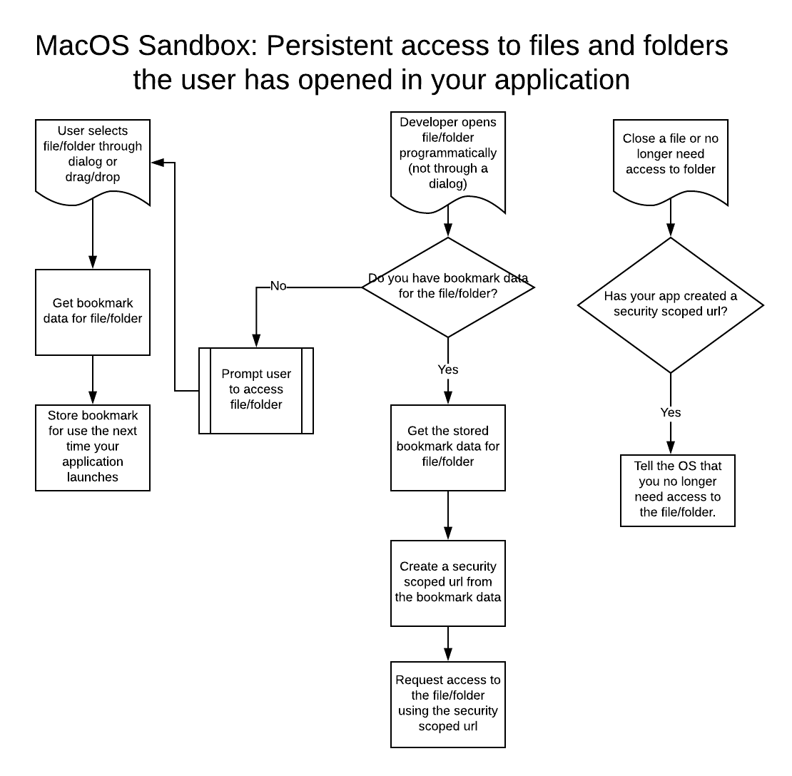

# sandbox
A [Levure](https://github.com/trevordevore/levure) helper that provides file access handlers for desktop applications running in the macOS sandbox. Requires LiveCode 9 or later as it makes use of the LiveCode Builder Foreign Function Interface.

To use this helper in your Levure application add the `levurehelper-sandbox` folder (you can rename it to `sandbox`) directly to your `./app/helpers` folder or add a reference to the folder to the list of `helpers` in the `app.yml` file.

# Introduction

When an application is distributed through the Mac App Store (MAS) it must be sandboxed. A sandboxed application can only access files outside of the application container if the user provides explicit permission to do so. In order to access these files across multiple sessions of an application the application makes use of `security-scoped bookmarks` and `security-scoped urls`.

A simple use case would be a recently opened files menu. The *Recent Files* menu lists documents that the user has opened in the past and may want to open again. If an application is sandboxed and it does not use `bookmarks` then the first time the user tried to open a file from the menu each app session they would have to select the file again using the `answer file` dialog. Using `bookmarks` the *Recent Files* menu can behave as intended in a sandboxed application.

Please review the following Apple documentation on **Security-Scoped Bookmarks and Persistent Resource Access** before continuing: https://developer.apple.com/library/archive/documentation/Security/Conceptual/AppSandboxDesignGuide/AppSandboxInDepth/AppSandboxInDepth.html#//apple_ref/doc/uid/TP40011183-CH3-SW16

# Overview

This diagram provides an overview of how security-scoped bookmarks, security-scoped urls work.



# Usage

You will call `sandboxIsInUse()` to determine if the sandbox is in use. The sandbox will be considered to be in use if the OS is macOS, the OS version is 10.7.3 or later, and the Levure build profile is `mac app store` or `mac app store development`.

## Opening a resource for the first time
When the user opens a resource (file or folder) from using the `ask/answer file` or `answer folder` dialogs your application is automatically granted access to the resource by the macOS sandbox. If you plan on accessing the resource the next time your application launches then create a security-scoped bookmark for the resource by calling `sandboxStoreBookmarkDataForFile`.

```
answer file "Select a document to open"
put it into tFilename

if tFilename is not empty then
  if sandboxIsInUse() then
    sandboxStoreBookmarkDataForFile tFilename
    put the result into tError
  end if
end if
```

## Restoring access to a resource
Next you need to determine how you are going to store and restore the bookmark data the next time your application launches. There are at two scenarios you need to account for:

1. Your application only accesses a few resources that don't change, but which reside outside of your sandboxed applications container (e.g. a Documents folder)
2. Your application provides a Recent Files menu option to open a file that they previously opened using an `open file` dialog.

### Accessing resources that don't change

If your application only accesses a few resources that don't change, but which reside outside of your sandboxed applications container (e.g. a Documents folder) then you can store and restore booksmarks in one go. You would call `sandboxGetBookmarkDataForFiles()` and store the result in a preference when your application quits and pass the preference value to `sandboxSetBookmarkDataForFiles` when your application launches. You would follow up the call to `sandboxSetBookmarkDataForFiles` with calls to `sandboxRestoreAccessToFile` for each resource you need access to.

```
command PreShutdownApplication
  ...

  if sandboxIsInUse() then
    prefsSetPref "security-scoped bookmarks", sandboxGetBookmarkDataForFiles()
    sandboxStopAccessingAllFiles
  end if

  ...
end PreShutdownApplication


command InitializeApplication
  ...

  if sandboxIsInUse() then
    sandboxSetBookmarkDataForFiles prefsGetPref("security-scoped bookmarks")

    ## tFilename1/2/3 represent files that your application always uses but which require user permission to access.
    if sandboxGetBookmarkDataForFile(tFilename1) is empty then
      # Prompt user to access folders/files that your application needs access to.
      ...
    else
      # User has already been prompted. Restore access.
      sandboxRestoreAccessToFile tFilename1
      sandboxRestoreAccessToFile tFilename2
      sandboxRestoreAccessToFile tFilename3
    end if
  end if

  ...
end InitializeApplication
```

### Recent files menu

If your application provides a File > Open Recent menu option then you need to store the bookmark data along with the recent file entry when adding the file to the list of recently opened files. When the user selects a file from the recent file menu you will need to restore access to the file using the bookmark data. The easiest way to do this is to use the [recent file APIs](https://github.com/trevordevore/levure/wiki/helper-file_system#recent-files) in the File System helper that ships with Levure. It provides support for working with bookmark data and will store the bookmark data in the preference that stores the list of recently opened files.

When opening a document account for the fact that the bookmark data may be passed in with the filename:

```
command OpenDocument pFilename, pSecurityScopedBookmarkData
  ...

  if sandboxIsInUse() then
    if pSecurityScopedBookmarkData is not empty then
      sandboxSetBookmarkDataForFile pFilename, pSecurityScopedBookmarkData
      sandboxRestoreAccessToFile pFilename
      put the result into tError
    end if
  end if

  # Add to recent files list
  if tError is empty then
    fileSystemAddToRecentlyOpened "documents", pFilename, pFilename, pSecurityScopedBookmarkData
    put the result into theError
  end if

  # If any files are purged from the recent files menu (array of purged files
  # is returned in it) due to the addition of the last file then the user can # no longer open the file without going through the OS. Remove bookmark data.
  if tError is empty then
    repeat for each element tFileA in it
      sandboxSetBookmarkDataForFile tFileA["file"], empty, false
    end repeat
  end if

  ...
end OpenDocument
```

When opening a recent file using the File > Open Recent menu you will pass in the stored bookmark data:

```
on menuPick pItemName
  set the itemDelimiter to "|"

  switch item 1 of pItemName
    ...
    case "open recent"
      put URLDecode(item 2 of pItemName) into tFilename
      put fileSystemSecurityBookmarkForRecentlyOpenedFile("documents", tFilename) into tBookmarkData
      uiOpenDocument tFilename, tBookmarkData
      break
    ...
  end switch
end menuPick
```

## Closing a resources

When you no longer need access to a resource (e.g. the user closes a document) call `sandboxStopAccessingFile`. To close all open resources when your application closes down you can call `sandboxStopAccessingAllFiles`.

```
command CloseDocument pFilename
  ...

  if sandboxIsInUse() then
    sandboxStopAccessingFile pFilename
  end if

  ...
end CloseDocument
```

```
command PreShutdownApplication
  ...

  if sandboxIsInUse() then
    sandboxStopAccessingAllFiles
  end if

  ...
end PreShutdownApplication
```

# API

Review the [API documentation](./docs/sandbox.md).

